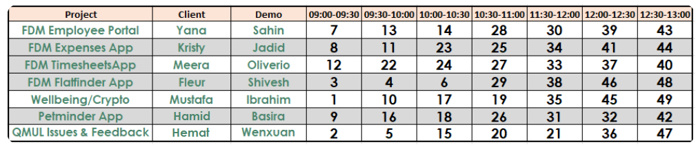
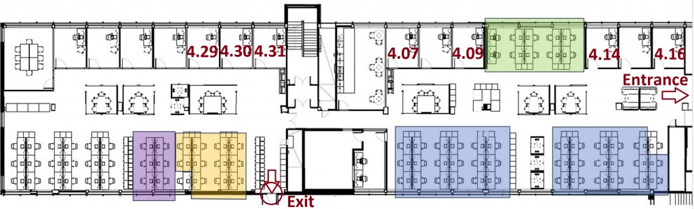

# ECS506U Software Engineering Project — Group 26

## Quick Info

- [QMPlus Page](https://qmplus.qmul.ac.uk/course/view.php?id=15588)
- **Lab time:** 10:00
- **Client:** Hamid | **Demo:** Basira
- **Time slot IDs:** 9, 16, 18, 26, 31, 32, 42

## Project Description

### Pet Minder

This project is creating a hub (application) for pet owners and pet minders (might be a specific pet only such as dogs, e.g. Gowalkies). The application allows pet owners to find minders (and vice versa) based on ratings, testimonials, location and availability. The app should allow pet owners to give specific instructions to minders such as choosing walking routes, minding directions, etc. The app should enable minders to track their pets during walks or other activities.

## Module Description

Brief description of the module is available on the module descriptor [here](https://intranet.eecs.qmul.ac.uk/courses/descriptor/eecsismodule/mod/ECS506U).

## Learning Aims and Outcomes

The primary learning outcome in this module is that you will think about learning as a mindset and a process — it has no end point.

By the end of the module the student will be able to:

- **Acquire technical knowledge:** Understand the difference between programming in the small and software system construction; understand and use object oriented design techniques and software quality assurance methods; produce a range of documentation necessary for software systems; understand how to deliver systems incrementally.
- **Acquire practical & managerial knowledge:** Work in a team environment to produce a high quality software system within budget & time while dealing with complexity and change; understand the principles of risk management in software engineering and relevant ethical, professional and legal issues.
- **Acquire highly marketable skills:** Become proficient in UML — the most widely used method for object oriented system design (and a CASE tool to support it); be able to build real-world Java programs using a widely used programming environment.

## Timetable for Deliverables

| Phase | Item | Weight | Deadline | Duration |
|-------|------|--------|----------|----------|
| Domain Analysis | Report | 15% | Monday 9th Feb | 3 weeks |
| Domain Analysis | Presentation | 10% | Thursday 12th Feb | 3 weeks |
| Requirements Elicitation | Report | 15% | Monday 23rd Feb | 2 weeks |
| Requirements Elicitation | Presentation | 10% | Thursday 26th Feb | 2 weeks |
| Design | Report | 15% | Monday 9th Mar | 11 days |
| Prototype | Presentation | 35% | Thursday 16th April | 6 weeks |

## Assessment Summary

There are weekly submissions in this module; there is no exam. Submissions and weightings:

| Phase | Submission | Weight |
|-------|------------|--------|
| Domain Analysis | Report | 15% |
| Domain Analysis | Presentation | 10% |
| RQ Elicitation | Report | 15% |
| RQ Elicitation | Presentation | 10% |
| Design | Report | 15% |
| Prototype | Presentation | 35% |

## Team (Group 26)

| First name | Last name | ID |
|------------|-----------|-----|
| Uliana | Makarova | 240120359 |
| William | Wingfield | 240327338 |
| Xinzhu | Zhao | 240059129 |
| Tahrima | Akther Milky | 230332519 |
| Rohan | Bhagat | 240134127 |
| Alaur | Rahman | 240220109 |
| Aradhya | Tripathi | 240920335 |

## Project Schedule (Demos & Time Slots)

Pet Minder App on the programme-wide schedule. Time slots: 09:00–09:30, 09:30–10:00, 10:00–10:30, 10:30–11:00, 11:30–12:00, 12:00–12:30, 12:30–13:00.

## 4th Floor Map

Floor plan of the 4th floor (offices, open workspaces, meeting rooms, stairwell, entrance and exit). Use for locating the team, meeting rooms, and collaboration areas.

- **Entrance** and **Exit** are marked in red.
- **Rooms:** numbered offices (e.g. 4.07, 4.09, 4.14, 4.16, 4.29, 4.30, 4.31).
- **Open areas** (colour-coded): green (top-right), purple (bottom-left), yellow/orange (bottom-centre), blue (bottom-right).
- **Stairwell:** upper-middle section.

## Domain Analysis Report

| Section | Assigned To |
|---------|-------------|
| 1. Introduction | Rohan |
| 2. Customers and Users | Xinzhu Zhao |
| 3. The Environment | Uliana |
| 4. Tasks and Procedures Currently Performed | Aradhya |
| 5. Competing Software | Alaur and Tahrima |
| 6. Domain Model | William |

